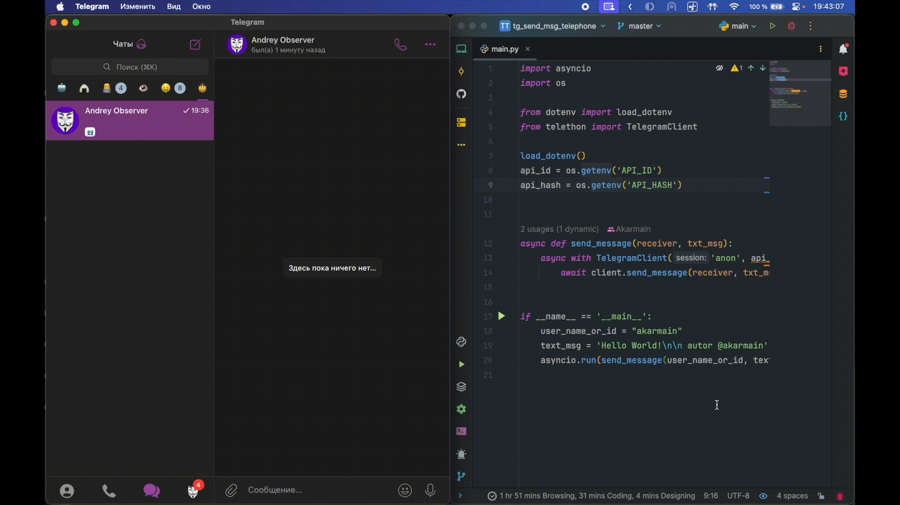

# Tg send msg
## Отправка сообщений telegram по user name на python


## настройка .env
1. Перейдите на [сайт](https://my.telegram.org/auth) и зарегистрируйте приложение чтобы получить данные для .env

```text
API_ID=1926432
API_HASH=1926432fffffff
```

### Установка библиотек  
```shell

# Создание виртуальной среды
python -m venv .venv

# Активация виртуальной среды
# Для Windows:
.venv\Scripts\activate
# Для macOS и Linux:
source .venv/bin/activate

# Установка зависимостей
pip install -r requirements.txt

# Запуск вашего основного скрипта
pip3 install -r requirements.txt 

# Запуск вашего основного скрипта
python main.py
```
